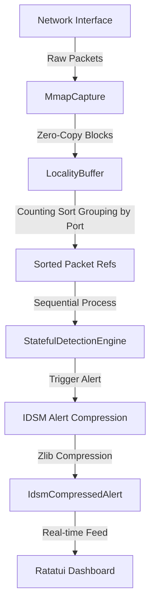

# Network Sensor (IDS) for Wi-Fi and Ethernet

An high-performance, real-time Intrusion Detection System (IDS) and network sensor written in Rust. This system implements a zero-copy packet processing pipeline designed for high-throughput network monitoring. It features Linux `PACKET_MMAP` (`TPACKET_V3`) packet capture, a zero-copy multi-protocol packet parser, a cache-aligned locality buffer utilizing counting sort grouping, a stateful detection engine, and an interactive Ratatui terminal dashboard.

---

## Architecture Overview



The system is organized into the following main components:

1. **High-Performance Capture ([capture.rs](file:///home/robin/Projects/sensors/WIFI-sensor/src/capture.rs))**:
   Uses raw Linux packet sockets (`AF_PACKET`, `SOCK_RAW`) bound with `PACKET_RX_RING` utilizing `TPACKET_V3` ring buffers. This maps kernel memory directly into user-space via `mmap`, avoiding context switch and copy overheads. If the socket cannot be created (due to permissions or platform limitations), the system automatically falls back to **Simulation Mode** (allowing testing without raw socket access).

2. **Zero-Copy Layered Parser ([parser.rs](file:///home/robin/Projects/sensors/WIFI-sensor/src/parser.rs))**:
   Recursively decodes link, network, transport, and application layers. It borrows sub-slices directly from the mmap buffer (`&[u8]`) to parse packet details without any heap allocation on the critical path.
   - **Link Layers**: Ethernet, IEEE 802.11 Wi-Fi, Radiotap (signal strength/RSSI, channel).
   - **Network Layers**: IPv4, IPv6, ARP.
   - **Transport Layers**: TCP (ports, sequence numbers, SYN/ACK flags), UDP, ICMP (types/codes).
   - **Application Layers**: DNS (subdomain queries), DHCP, EAPOL (handshake packets).

3. **Locality Buffer Grouping ([locality.rs](file:///home/robin/Projects/sensors/WIFI-sensor/src/locality.rs))**:
   Groups batches of up to 4096 packets by destination/source port in $O(N)$ time using a cache-aligned counting sort algorithm. This contiguous layout maximizes CPU L2/L3 cache hit rates when the stateful engine processes related traffic streams sequentially.

4. **Stateful Detection Engine ([engine.rs](file:///home/robin/Projects/sensors/WIFI-sensor/src/engine.rs))**:
   Monitors network activity across a sliding correlation window (typically 60 seconds) to detect anomalous behaviors. It tracks access points, client metadata states, EAPOL handshake progression, and IP-level patterns.

5. **IDSM Alert Compression ([alert.rs](file:///home/robin/Projects/sensors/WIFI-sensor/src/alert.rs))**:
   Emulates an automotive Intrusion Detection System Manager (IDSM) payload. Serializes security alert details (including the offending packet sequence summaries) into JSON, then compresses the payload using Zlib compression (`flate2`) to save network transmission bandwidth, calculating and displaying the compression ratios in real-time.

6. **TUI Dashboard ([dashboard.rs](file:///home/robin/Projects/sensors/WIFI-sensor/src/dashboard.rs))**:
   An interactive Terminal User Interface driven by `ratatui` and `crossterm`. Features multiple tables and scrolling paragraph panes to inspect raw metrics, alert timelines, hexadecimal dumps of IDSM compressed alerts, and structured JSON logs.

---


<!--
## Detection Rules

The [StatefulDetectionEngine](file:///home/robin/Projects/sensors/WIFI-sensor/src/engine.rs#L81) evaluates the following stateful rules:

* **Rule 1: Scan and Probe Activity**
  - **Rule 1.1 (Probe Flooding)**: Detects clients sending excessive Wi-Fi Probe Requests (25+ requests in 60s), indicating aggressive discovery scans.
  - **Rule 1.2 (SSID Enumeration)**: Identifies clients scanning for multiple specific vehicle SSIDs (e.g., querying Tesla, Audi, MyCar profiles).
* **Rule 2: Association and Authentication**
  - **Auth Brute Force**: Triggers when a client client fails Wi-Fi association/authentication 5+ times.
  - **Reconnect Abuse**: Detects rapid association flood events (8+ associations in 60s) targeting a specific BSSID.
* **Rule 3: WPA/WPA2/WPA3 Negotiation**
  - **Handshake Failures**: Monitors EAPOL handshakes for key verification failure flags (indicative of dictionary attacks).
  - **KRACK Key Replays**: Detects repeated replay counters on EAPOL message 3, indicating potential Key Reinstallation Attacks.
* **Rule 4: Management Frame Attacks**
  - **Twin AP / Rogue AP**: Detects beacon frames broadcasting the authorized vehicle hotspot SSID but originating from an unauthorized BSSID.
  - **Deauthentication Flood**: Detects deauthentication storms (10+ deauth/disassociation frames in 10s) aiming to disconnect clients.
* **Rule 5: Vehicle Hotspot Monitoring**
  - **Security Downgrade**: Alerts if the vehicle's secure hotspot is modified/broadcast as an "Open" network.
  - **Channel Shift**: Triggers alerts if the hotspot shifts channels unexpectedly.
* **Rule 6: Wireless Projection**
  - Detects wireless projection (CarPlay/Android Auto) connection attempts on the Wi-Fi network without matching Bluetooth pairing/handoff exchanges.
* **Rule 8: Malformed Frames**
  - Triggers immediately when zero-copy headers fail parsing bounds or contain corrupt lengths matching known firmware crash patterns.
* **Rule 9: Traffic After Association**
  - **Port Scans**: Detects TCP SYN sweeps or UDP scans targeting 20+ unique ports.
  - **Diagnostic API Sweep**: Detects unauthorized sweeps on vehicle diagnostics ports (e.g. DoIP port 13400 or firmware updates port 9000).
  - **DNS Tunneling**: Detects high-frequency lengthy subdomain queries indicating outbound data exfiltration.
* **Rule 10: Infotainment Services**
  - Identifies unauthorized clients connecting to private infotainment services (ports 9000, 8081, 8008) from non-whitelisted IP subnets.


-->
---

## Getting Started

### Prerequisites
- A **Linux** environment is required for live network capture (using raw packet sockets and `mmap`). On other operating systems, the project builds and runs in simulation fallback mode.
- **Rust Toolchain**: Cargo and rustc (2024 edition).

### Building the Project
To compile the release binary:
```bash
cargo build --release
```

### Running the Application

#### 1. Live Packet Capture Mode
To run with live capture on a specific wireless or ethernet interface, execute the binary with root privileges (required for raw packet sockets):
```bash
sudo ./target/release/network-sensor -i wlan0mon
```
*(Or choose an ethernet interface, e.g., `eth0`)*

---

## Interactive Controls

The Ratatui TUI dashboard supports full keyboard and mouse navigation:

| Key | Action |
| --- | --- |
| `q` or `Esc` | Quit the application |
| `p` | Pause / Resume capture and metrics |
| `c` | Clear the alerts list and reset counters |
| `Tab` | Cycle focus between the four panes (Alerts, Packets, Hex View, JSON View) |
| `Up` / `Down` | Scroll selected items or lines within the active focused pane |
| `Left` / `Right` | Scroll horizontally within the IDSM Hex and JSON views |
| **Mouse Click** | Click directly on a pane to focus it, or select table rows |

---

## Performance and Benchmarks

The project comes with a comprehensive suite of Criterion benchmarks checking parsing, locality buffer sorting, rules evaluation, and alert compression.

Run the benchmarks using:
```bash
cargo bench
```

These benchmarks evaluate:
- `parse_80211_beacon`: Performance of parsing complex 802.11 management frames.
- `parse_ethernet_tcp`: Parsing performance of standard TCP over IPv4 frames.
- `locality_grouping_1000_pkts`: Speed of counting sort grouping on packet batches.
- `engine_process_tcp_syn`: Processing times for TCP SYN checks in the detection engine.
- `idsm_compress_zlib`: Performance of IDSM alert serialization and Zlib compression.
