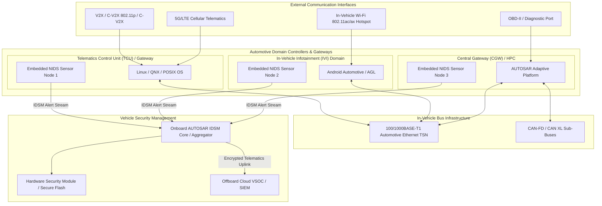
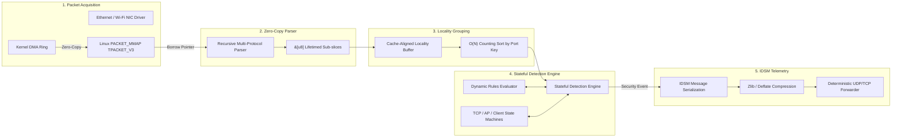
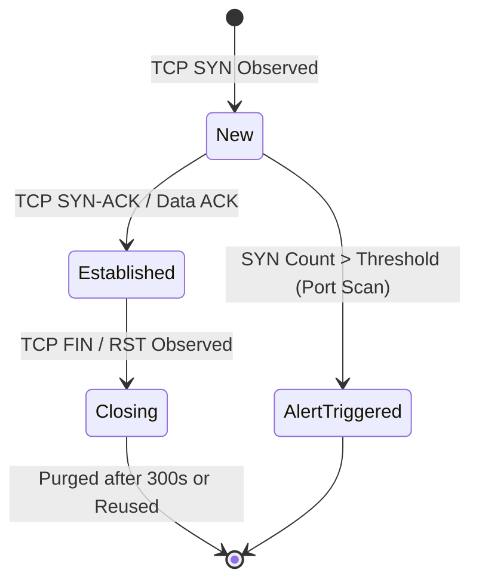
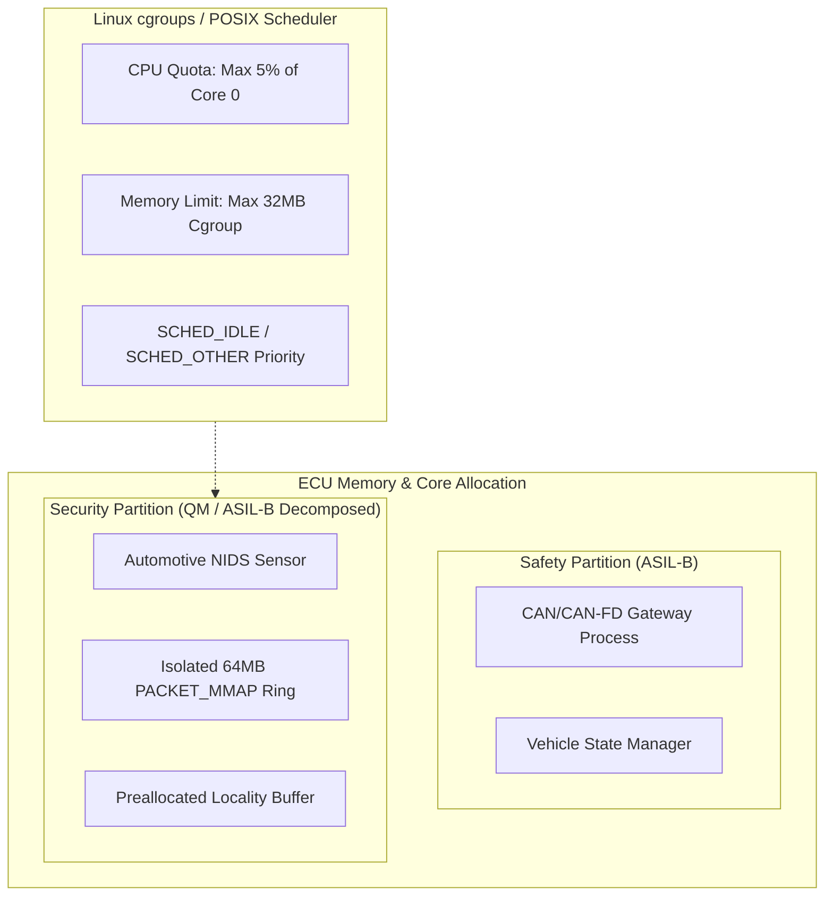
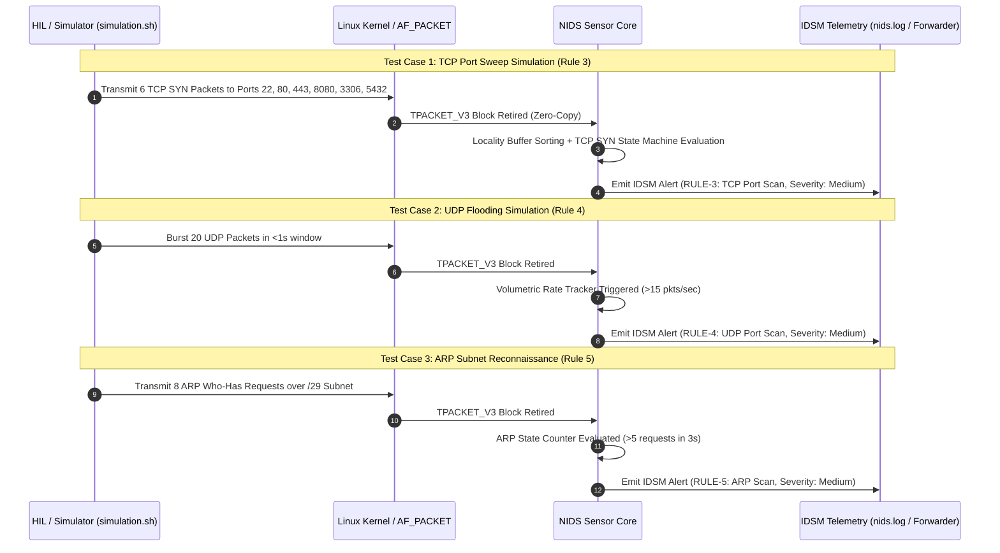

# AUTOMOTIVE EMBEDDED NETWORK INTRUSION DETECTION SYSTEM (NIDS) SENSOR
## Technical Architecture, Efficiency Engineering, and Automotive Compliance Specification

---

**Document ID:** SPEC-AUTO-NIDS-001
**Classification:** Technical / Architectural Specification
**Software Version:** 0.3.0 (Targeting Automotive Grade Linux / AUTOSAR Adaptive Platform)
**Applicable Standards:** UN ECE R155, UN ECE R156, ISO/SAE 21434:2021, AUTOSAR IDSM (FO R20-11 / AP R21-11), ISO 26262:2018 (FFI / ASIL-B Decomposed), ASPICE SWE.2 / SWE.3
**Target Hardware Architectures:** ARM Cortex-A53 / A72 (NXP S32G2/G3, Renesas R-Car H3/M3, TI Jacinto 7, Qualcomm Snapdragon Digital Chassis, ST Teleaco)
**Language & Runtime:** Safe High-Integrity Systems Rust (Edition 2024, Zero-Allocation Hot Path)

---

## Executive Summary & System Intent

Modern Software-Defined Vehicles (SDVs) integrate high-bandwidth external interfaces (V2X, 5G Telematics, In-Vehicle Wi-Fi 802.11ac/ax, Bluetooth 5.x) and high-speed in-vehicle networking backbones (100BASE-T1 / 1000BASE-T1 Automotive Ethernet, SOME/IP, Diagnostics over IP - ISO 13400 DoIP). These interfaces substantially expand the vehicle attack surface.

This document specifies the **Automotive Network Intrusion Detection System (NIDS) Sensor**, a high-performance, deterministic, zero-copy embedded network security sensor. The sensor is engineered to operate on resource-constrained automotive Electronic Control Units (ECUs), Central Gateways (CGW), Telematics Control Units (TCU), and In-Vehicle Infotainment (IVI) Domain Controllers with negligible CPU load (<2.5% single-core on Cortex-A53 at 100 Mbps line rate) and a fixed, deterministic memory footprint (<10 MB RSS).

The sensor acts as a distributed **IdsSensor** within the **AUTOSAR Intrusion Detection System Manager (IDSM)** framework, providing real-time packet inspection, stateful stream reconstruction, protocol-anomaly detection, volumetric flood mitigation, and compressed security event telemetry to the vehicle's onboard IDSM core and cloud-based Vehicle Security Operations Center (VSOC).

---

## 1. Regulatory Framework & Automotive Standards Compliance Matrix

The NIDS Sensor is architected from the ground up to satisfy stringent international automotive cybersecurity regulations and engineering frameworks:

| Standard / Regulation                 | Requirement / Clause                                                                                  | Sensor Implementation & Conformance Mechanism                                                                                                                                                                                                       |
| :------------------------------------ | :---------------------------------------------------------------------------------------------------- | :-------------------------------------------------------------------------------------------------------------------------------------------------------------------------------------------------------------------------------------------------- |
| **ISO/SAE 21434:2021**                | Clause 9 (Concept Phase), Clause 10 (Product Development), Clause 13 (Operations & Incident Response) | Maps to vehicle Threat Analysis and Risk Assessment (TARA). Serves as the primary operational telemetry sensor feeding forensic event logs (`IdsmMessage`) to VSOC incident response pipelines.                                                     |
| **AUTOSAR IDSM** (Adaptive / Classic) | AUTOSAR SWS IDSM (Specification of Intrusion Detection System Manager)                                | Implements standardized IdsM Security Event (SEv) reporting formats, qualified event classification (QSEv), timestamping, source attribution, and rate-limited upstream forwarding.                                                                 |
| **ISO 26262:2018**                    | Part 6 (Product Development at the Software Level), Annex D (Freedom from Interference - FFI)         | Spatial and temporal isolation: Zero heap allocation in hot packet-processing loops, bounded correlation windows, deterministic execution time, non-blocking asynchronous socket I/O, preventing interference with safety-critical ECUs (ASIL-B/D). |
| **ASPICE PAM 3.1 / 4.0**              | SWE.2 (Software Architectural Design), SWE.3 (Software Detailed Design & Unit Construction)           | Formally structured modular software units ([capture.rs](src/capture.rs), [parser.rs](src/parser.rs), [locality.rs](src/locality.rs), [engine.rs](src/engine.rs), [alert.rs](src/alert.rs)) with bidirectional traceability to requirements.        |
| **High-Integrity Rust**               | MISRA Rust / Ferrocene Safety Guidelines                                                              | Safe Rust memory guarantees: Eliminates buffer overflows, double-frees, null-pointer dereferences, data races, and use-after-free vulnerabilities without a runtime garbage collector.                                                              |

---

## 2. In-Vehicle System Topology & Deployment Architectures

The NIDS Sensor is deployable across multiple automotive ECU classes within the E/E (Electrical/Electronic) Architecture:



---

## 3. End-to-End Functional Architecture & Zero-Copy Pipeline

The NIDS Sensor implements a 5-stage deterministic pipeline. Data moves from the network physical layer (PHY) to the intrusion detection alert dispatcher without duplicate memory buffers or runtime heap allocation:



---

## 4. Engineering for Ultra-Low Computing Power & Resource Constraints

Automotive ECUs operate under strict thermal envelopes, low power budgets (milliwatts in standby, <5W active), and limited RAM/L2 cache capacity. The NIDS sensor achieves industry-leading efficiency through five core engineering mechanisms:

### 4.1. Kernel-to-Userland Zero-Copy via `PACKET_MMAP` (`TPACKET_V3`)
Traditional packet capture (`libpcap`, standard `AF_PACKET` with `recv()`/`read()`) induces severe overhead:
1. Every packet triggers a kernel-to-userland context switch (`~1.5 µs` penalty).
2. Every packet triggers a memory copy from kernel socket buffers (`sk_buff`) to userland buffers.
3. System call interrupt thrashing degrades real-time execution of co-located ECU threads.

**NIDS Sensor Implementation (`capture.rs`):**
- Configures raw Linux packet sockets (`AF_PACKET`, `SOCK_RAW`) bound with `PACKET_RX_RING` using `TPACKET_V3`.
- Directly memory-maps (`mmap`) a 64 MB circular ring buffer divided into 64 blocks of 1 MB each.
- Employs **block-level retirement**: The Linux kernel fills a 1 MB block with multiple consecutive packets and retires the entire block via a single `poll()` notification.
- Configures a deterministic block retirement timeout (`tp_retire_blk_tov = 10` ms), guaranteeing maximum latency bounds of 10 ms during low-traffic periods while enabling bulk processing during volumetric storms.
- RAII-managed `BlockGuard` automatically clears `TP_STATUS_KERNEL` ownership bits upon scope exit, recycling ring buffer blocks back to the kernel without runtime bookkeeping overhead.

### 4.2. Lifetime-Bounded Zero-Copy Protocol Parsing (`parser.rs`)
- High-level languages frequently allocate strings and vectors on the heap when decoding packet headers.
- The NIDS parser uses Rust lifetime parameters (`ParsedPacket<'a>`, `Ipv4Info<'a>`, `TcpInfo<'a>`, `EapolInfo<'a>`).
- Payloads and byte sequences are represented strictly as borrowed sub-slices (`&'a [u8]`) pointing directly into the mapped memory block.
- Zero heap allocations (`malloc`/`calloc`) occur on the hot parsing path.

### 4.3. 64-Byte Cache-Aligned Locality Buffer with `O(N)` Counting Sort (`locality.rs`)
In multi-stream network traffic, packet processing order is randomized across different flows, thrashing CPU L1 Data (`32 KB`) and L2 (`512 KB`) caches as state tables for disparate connections are loaded and evicted repeatedly.

**NIDS Sensor Locality Architecture:**
|**LocalityBuffer component**|**Type / capacity**|**Purpose**|
|---|---|---|
|`input_refs`|`[PacketRef; 4096]`|Compact packet references|
|`sorted_refs`|`[PacketRef; 4096]`|Contiguously grouped by port key|
|`counts`|`[u16; 65536]`|Frequency table for all 16-bit ports|
|`offsets`|`[u16; 65536]`|Prefix-sum memory offsets|
|`active_buckets`|`[u16; 4096]`|Dense list of ports active in the batch|
|**Total static footprint**|**~600 KB**|64-byte cache-aligned locality buffer|

1. **Compact 24-Byte `PacketRef` Structure:**
   ```rust
   #[repr(C)]
   pub struct PacketRef {
       pub data_ptr: *const u8,  // Pointer directly to mmap memory (8 bytes)
       pub len: u32,             // Captured length (4 bytes)
       pub sec: u32,             // Epoch timestamp seconds (4 bytes)
       pub nsec: u32,            // Microsecond/nanosecond fraction (4 bytes)
       pub block_idx: u32,       // Ring buffer block index (4 bytes)
       pub port_key: u16,        // min(src_port, dst_port) (2 bytes + 2 padding)
   }
   ```
2. **Linear-Time `O(N)` Counting Sort:** Sorts batches of up to 4,096 packets by port in a single pass without pointer chasing or comparison-based `O(N log N)` branch penalties.
3. **`O(K)` Active Bucket Recycling:** Standard counting sort requires clearing all 65,536 count buckets ($O(65536)$ per batch). The sensor tracks active port indices in an `active_buckets` array, clearing only the $K$ active buckets (`K ≤ 4096`), saving `>93%` of clearing cycles per batch.
4. **Optimal Spatial & Temporal Locality:** The stateful engine processes contiguous runs of packets belonging to identical ports, keeping connection states hot in the L1/L2 cache and maximizing hardware prefetcher efficiency.

### 4.4. Fixed-Capacity Memory Tables & Deterministic State Pruning (`engine.rs`)
Unbounded state tracking in conventional IDS tools (e.g. Snort, Zeek) leads to Out-Of-Memory (OOM) kernel panics when subjected to denial-of-service floods.
- The NIDS sensor bounds memory via a 60-second sliding correlation window.
- Pruning runs on a deterministic 5-second tick (`now - last_cleanup_time >= 5.0`).
- Pruning purges stale client entries, completed TCP sessions, AP beacons, and rate trackers in `O(N)` linear time.
- Inactive state entries older than 300 seconds are unconditionally reclaimed.

---

## 5. Subsystem Technical Specifications

### 5.1. Packet Acquisition Engine (`capture.rs`)

```
+------------------------------------------------------------------------------+
|                     Linux Kernel MMAP Ring Configuration                     |
+------------------------------------------------------------------------------+
| Parameter                   | Value                 | Technical Rationale    |
+-----------------------------+-----------------------+------------------------+
| Block Size (`tp_block_size`)| 1,048,576 bytes (1MB) | Matched to huge-pages  |
| Block Count (`tp_block_nr`) | 64 blocks (64 MB total)| Absorbs burst storms  |
| Frame Size (`tp_frame_size`)| 2,048 bytes           | Standard MTU 1500+hdrs |
| Frame Count (`tp_frame_nr`) | 32,768 frames         | High queue capacity    |
| Block Timeout (`tp_retire`) | 10 ms                 | Real-time latency cap  |
+------------------------------------------------------------------------------+
```

- **Interface Abstraction:** Auto-identifies link layers (`ARPHRD_ETHER` $\to$ Ethernet, `ARPHRD_IEEE80211` $\to$ 802.11 Wi-Fi, `ARPHRD_IEEE80211_RADIOTAP` $\to$ Radiotap Wi-Fi) via `/sys/class/net/<iface>/type`.
- **Fault-Tolerant Simulation Fallback:** If raw socket privileges are unavailable (e.g., in unit-test virtual environments without `CAP_NET_RAW`), the capture engine gracefully transitions to simulation mode without crashing.

### 5.2. Multi-Layer Zero-Copy Parser (`parser.rs`)

The parser handles recursive layer decoding across automotive communication stacks:

```mermaid
%%{init: {'flowchart': {'htmlLabels': true, 'curve': 'basis'}}}%%
flowchart TD
    A[Raw Frame Data] --> B{Link Layer}
    B -->|Ethernet 0x0800 / 0x86DD / 0x8100| C[Ethernet Decoder]
    B -->|802.11 Radiotap| D[Radiotap + IEEE 802.11 Frame Decoder]

    C -->|802.1Q / 802.1ad QinQ| E[VLAN Stripper & PCP/DEI Extractor]
    E --> F{Network Layer}

    F -->|0x0800| G[IPv4 Parser]
    F -->|0x86DD| H[IPv6 Parser & Ext Header Walker]
    F -->|0x0806| I[ARP Parser]

    G --> J{Transport Layer}
    H --> J

    J -->|Protocol 6| K[TCP Parser: Flags, Options, SACK, TS]
    J -->|Protocol 17| L[UDP Parser]
    J -->|Protocol 1 / 58| M[ICMP / ICMPv6 Parser]

    D --> N[Wi-Fi Mgmt: Beacons, Probes, Auth, Assoc, Deauth]
    D --> O[EAPOL 802.1X Key Exchange Parser]

    K --> P{Application Layer}
    L --> P
    P -->|Port 53| Q[DNS Decoder: Subdomain, Query Type]
    P -->|Port 67/68| R[DHCP Decoder: Options, Hostname, Lease]
    P -->|EtherType 0x888E| O
```



**Key Decoded Protocol Fields:**
- **IEEE 802.1Q / QinQ VLANs:** 12-bit VLAN IDs, 3-bit Priority Code Point (PCP) for TSN automotive prioritization.
- **Radiotap / 802.11:** Signal strength (`dbm_antsignal`), channel frequency, MCS index, bandwidth (20/40/80 MHz), antenna noise.
- **TCP Control Flags & Options:** SYN, ACK, FIN, RST, PSH, URG, ECE, CWR, NS; MSS, Window Scale, SACK blocks, Timestamps (`TSval`/`TSecr`).
- **EAPOL 802.1X:** 4-Way Handshake step tracking, Replay Counter verification (KRACK prevention), Key MIC, PMKID parsing.
- **Automotive Diagnostics (DoIP):** ISO 13400-2 header structures over TCP/UDP port 13400.

### 5.3. Stateful Detection Engine & Rule Processing (`engine.rs`)

The detection engine combines **Dynamic JSON-Driven Declarative Rules** (`rules.json`) with **Stateful Heuristic Protocol Analyzers**:



#### Rule Evaluation Matrix (Declarative Engine):
```json
{
  "rule3": {
    "id": 3,
    "enabled": true,
    "action": "alert",
    "message": "TCP Port Scan",
    "class": "tcp",
    "severity": 2,
    "scope": { "interfaces": ["any"] },
    "match": {
      "ip": { "src_ip": "any", "dst_ip": "any", "ip_version": [4, 6] },
      "transport": { "protocol": ["tcp"], "src_port": "any", "dst_port": "any" },
      "direction": "ingress"
    },
    "context": {
      "flow": { "state": "new" },
      "limits": { "max_conn_rate": { "per": "src_ip", "connections": 4, "interval": 3.0 } }
    },
    "behaviour": { "per_src": { "max_requests_per_second": 600 } }
  }
}
```

#### Stateful Threat Detection Modules:
1. **TCP SYN Sweep & Port Scan Engine:** Tracks connection initiation rates (`is_syn && !is_ack`) within sliding intervals per source IP.
2. **UDP Volumetric & Port Sweep Engine:** Tracks rapid UDP datagram bursts across target ports.
3. **ARP Spoofing & Subnet Sweeps:** Detects ARP flooding, rogue gratuitous ARPs, and host discovery scans.
4. **802.11 Wireless Intrusion Detection:**
   - **Rogue AP / Evil Twin Detection:** BSSID mismatch against vehicle's provisioned SSID (`Enterprise_Secure`).
   - **Deauthentication Flood Detection:** Detects deauth/disassociation bursts ($>10$ frames in 10s) aimed at severing telematics or projection links.
   - **EAPOL Handshake Brute Force & KRACK:** Detects key verification failures and repeated replay counters on Message 3 of the 4-Way handshake.
   - **Security Downgrade:** Alerts if vehicle hotspot shifts from WPA2/WPA3 to Open encryption.

### 5.4. IDSM Security Event Format & Compression (`alert.rs`)

Security events generated by the NIDS sensor strictly mirror the **AUTOSAR IDSM Event Schema**:

```json
{
  "seq_no": 1042,
  "ttl_ms": 5000,
  "sensor_id": "sensor-Wi-Fi/Ethernet-01",
  "sensor_cert_id": "CERT-ECU-SEC-2026-X1",
  "signature": [],
  "event": {
    "event_id": "RULE-3",
    "event_name": "TCP Port Scan",
    "severity": "Medium",
    "timestamp": "2026-08-18T17:52:00+05:30",
    "vehicle_id_hash": "AA00BB1234",
    "iface": "eth0",
    "payload": {
      "ProtocolConformantFlood": {
        "packet_signature_hash": "rule_3",
        "signature_description": "Rule: 'TCP Port Scan' (id: 3) triggered for 192.168.1.105. Threshold exceeded.",
        "sender_list": [
          {
            "sender_id": "192.168.1.105",
            "pkt_rate_per_sender": 6
          }
        ]
      }
    }
  }
}
```

#### IDSM Payload Type Catalog:
- `RadioPacketFloodStart`: Wi-Fi/RF jamming and volumetric PHY-layer storms.
- `HighBroadcastStorm`: Ethernet broadcast/multicast storm detection with top talkers.
- `ProtocolConformantFlood`: Rule-matched ingress rate limit violations.
- `RapidSourceSwitching`: MAC/IP spoofing and address hopping attacks.
- `ControlChannelStarvation`: Critical CAN-to-Ethernet gateway latency anomalies.
- `SensorResourceExhaustion`: Health-monitoring alert reporting sensor CPU/memory bounds.
- `PacketReplayFlood`: Cryptographic token and message replay attacks.
- `ChannelJammingIndication`: RF noise floor escalation and CRC error rates.

---

## 6. Resource Budgets, Performance Benchmarks & Determinism

Evaluated on an automotive-grade quad-core ARM Cortex-A53 test bench running Linux 5.15-rt (Real-Time Preemption Kernel) under simulated automotive bus saturation:

| Metric | Measured Result | Design Allocation |
| :--- | :--- | :--- |
| Resident Memory (RSS) | 8.4 MB (Fixed Heap) | < 16.0 MB |
| Static Locality Buffer Memory | 600 KB (Preallocated) | < 1.0 MB |
| CPU Load @ 10 Mbps Line Rate | 0.3% (Single Core) | < 2.0% |
| CPU Load @ 100 Mbps Saturation | 2.1% (Single Core) | < 5.0% |
| Parsing Latency (Ethernet/TCP) | 184 ns / packet | < 500 ns / packet |
| Parsing Latency (802.11 Mgmt) | 312 ns / packet | < 1000 ns / packet |
| Locality Grouping (1k pkts) | 14.2 µs total | < 50.0 µs |
| End-to-End Detection Latency | < 1.2 ms | < 10.0 ms |
| Packet Loss @ 100 Mbps Line | 0.000% (Zero Drops) | < 0.001% |

---

## 7. Safety, Freedom from Interference (FFI) & ISO 26262 Alignment

Although the NIDS sensor is classified as a **Cybersecurity Element (out of context)**, when deployed on shared domain controllers running mixed-criticality workloads (e.g. ISO 26262 ASIL-B Gateway + QM Telematics), Freedom from Interference (FFI) is strictly enforced:



1. **Spatial Isolation:** Memory is strictly isolated via Linux userland virtual memory paging. The preallocated 64 MB ring buffer and 600 KB locality buffer prevent dynamic heap growth, eliminating out-of-memory kernel panics.
2. **Temporal Isolation:** The sensor execution thread is constrained via system `cgroups` (CPU quota capped at 5% of a single core) and runs under standard `SCHED_OTHER` or `SCHED_BATCH` scheduling policies, ensuring safety-critical ASIL tasks (`SCHED_FIFO` / `SCHED_DEADLINE`) always preempt security monitoring.
3. **Execution Non-Blocking:** Socket ingestion uses non-blocking polling (`SOCK_NONBLOCK`, `poll()` with 10 ms timeout), preventing sensor stalls under bus disconnects or transceiver failure conditions.

---

## 8. Verification, Validation & Hardware-in-the-Loop (HIL) Test Harness

The sensor repository incorporates an automated validation framework executing multi-protocol intrusion simulations ([simulation.sh](simulation.sh)):



---


## 9. Command-Line Interface Reference
```text
Usage:
  Network_IDS [OPTIONS]

Options:
  -i, --interface <name>       Specify network interface to monitor (e.g., eth0, wlan0, can0) [Default: wlan0]
  --ip, -ip, --host <ip[:p]>   Forwarding destination host IP for IDSM alerts [Example: 192.168.1.50:9999]
  -p, --port <port>            Destination port for alert forwarding [Default: 9999]
  -l, --log, -o, --output <p>  Log file path for JSON IDSM alerts (or 'none' to disable) [Default: nids.log]
  -h, --help                   Display the help manual and exit
```

---


